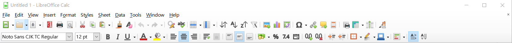
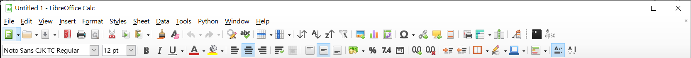
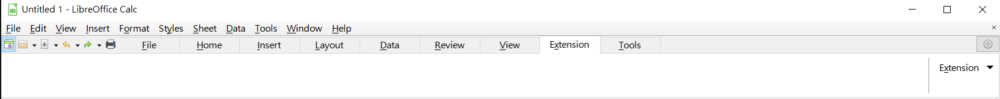
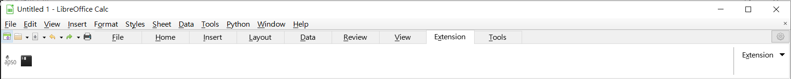
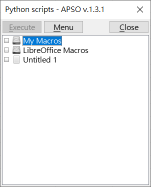
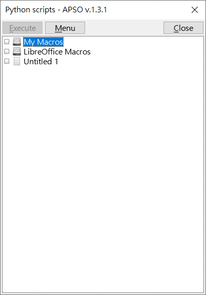
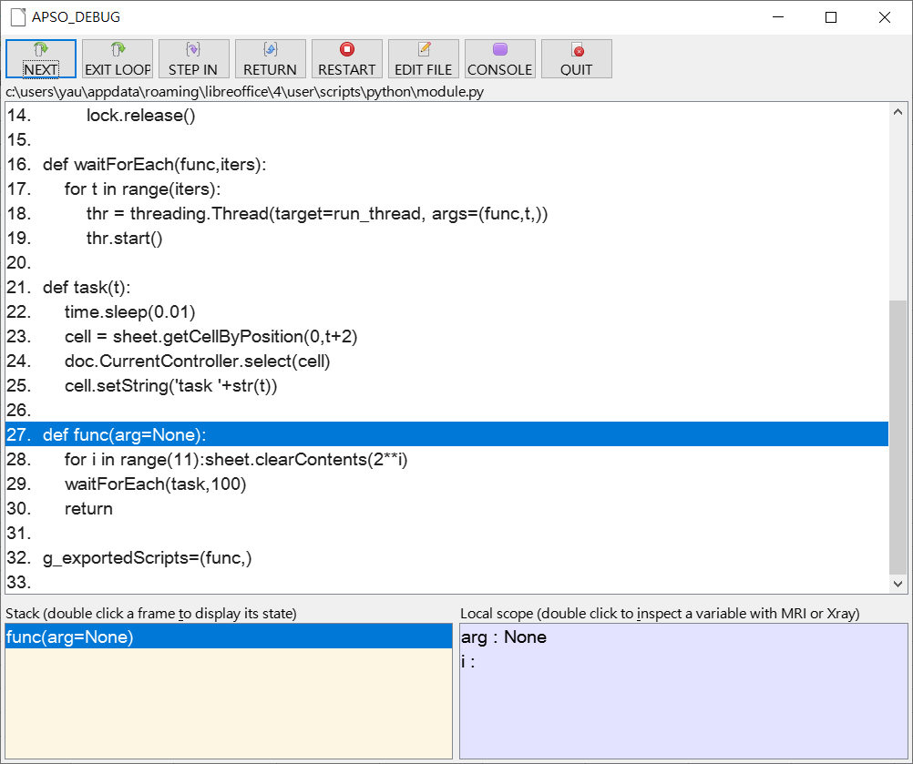
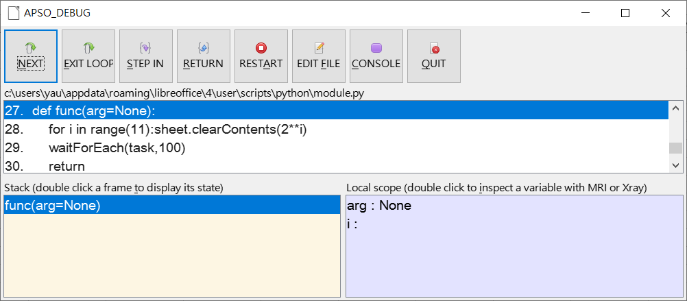
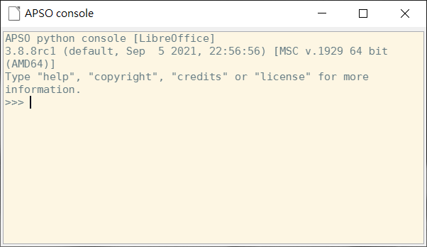
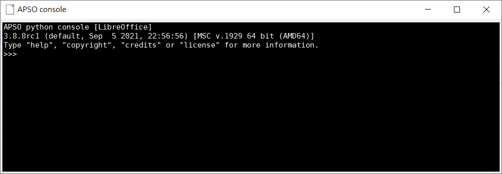

# Alternative python script organizer for LibreOffice (modified)

Based On aspo 1.3.1

This is WongHu modified apso extension for himeself

If you want LibreOffice aspo extension of normal version , you shold be go to [Jean-Marc Zambon apso  ](https://gitlab.com/jmzambon/apso)

Alternative Python Script Organizer, by Hanya,Jean-Marc Zambon.

* sources/icons/45.png
* tools.py
* AddonUI.xcu
* apso.py line 600-602,926
* apso_debug.py line 62,686
By WongHu

# toolbar 

 
# notebookbar

# apso dialog

|||
|-|-|
|||

# apso debug

|||
|-|-|
|||

# apso console

|||
|-|-|
|||

# icon

|||
|-|-|
|||
